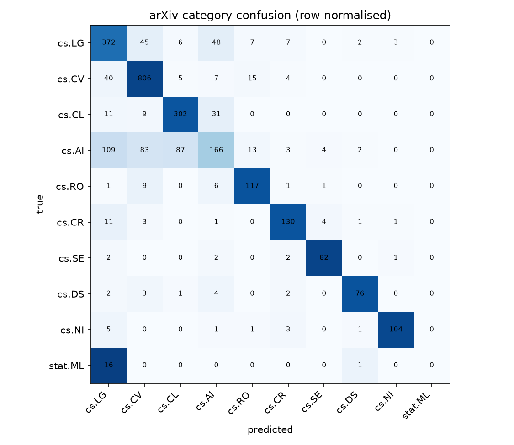

# Model evaluation — v1.0.0

Held-out test split, 2782 papers. Generated by `training/train.py`.

| metric | value |
|---|---|
| top-1 accuracy | 0.775 |
| top-3 accuracy | 0.9881 |
| macro F1 | 0.7237 |

## Artifact

| | |
|---|---|
| Hub repo | [`erenrosman/arxiv-classifier-v1`](https://huggingface.co/erenrosman/arxiv-classifier-v1) |
| Revision | `8eb5e4732aa4e3e2903df4d2e857f3cbf4ca6518` |

Pin that revision in the Dockerfile `ARG` at M4 — it is what makes a rebuild
six months from now produce the identical image.

## Per-class recall

| label | correct / total | recall |
|---|---|---|
| cs.LG | 372 / 490 | 0.759 |
| cs.CV | 806 / 877 | 0.919 |
| cs.CL | 302 / 353 | 0.856 |
| cs.AI | 166 / 467 | **0.355** |
| cs.RO | 117 / 135 | 0.867 |
| cs.CR | 130 / 151 | 0.861 |
| cs.SE | 82 / 89 | 0.921 |
| cs.DS | 76 / 88 | 0.864 |
| cs.NI | 104 / 115 | 0.904 |
| stat.ML | 0 / 17 | **0.000** |

## What the matrix says

**Top-3 is 0.988 while top-1 is 0.775.** The model almost always understands the
paper; the gap is which of several defensible labels the author happened to pick.
That gap is the point of the project, not a defect to tune away.

**cs.AI is a grab-bag, not a topic — 35.5% recall.** Its errors go to cs.LG (109),
cs.CL (87) and cs.CV (83): papers that are genuinely about learning, language or
vision, filed by their authors under cs.AI. No amount of training fixes a label
that doesn't describe a subject.

**stat.ML is a dead class — 17 test papers, never once predicted.** The primary
category is taken as `categories[0]`, and a stat.ML paper on arXiv nearly always
lists cs.LG first, so stat.ML is ~0.6% of the data as a *primary* label. The model
correctly learned that guessing it never pays.

Its F1 of 0.0 is most of the macro-F1 gap: across the other nine classes the
average is about **0.80**, which is the honest figure for what was learned. Kept
in the label set and reported rather than quietly dropped — macro-F1 is included
precisely so a dead class can't hide behind top-1 accuracy.
